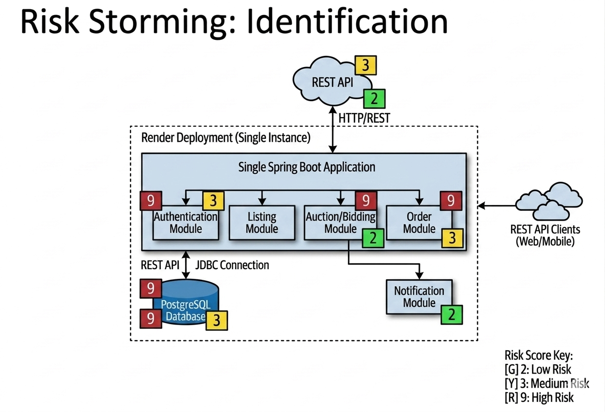
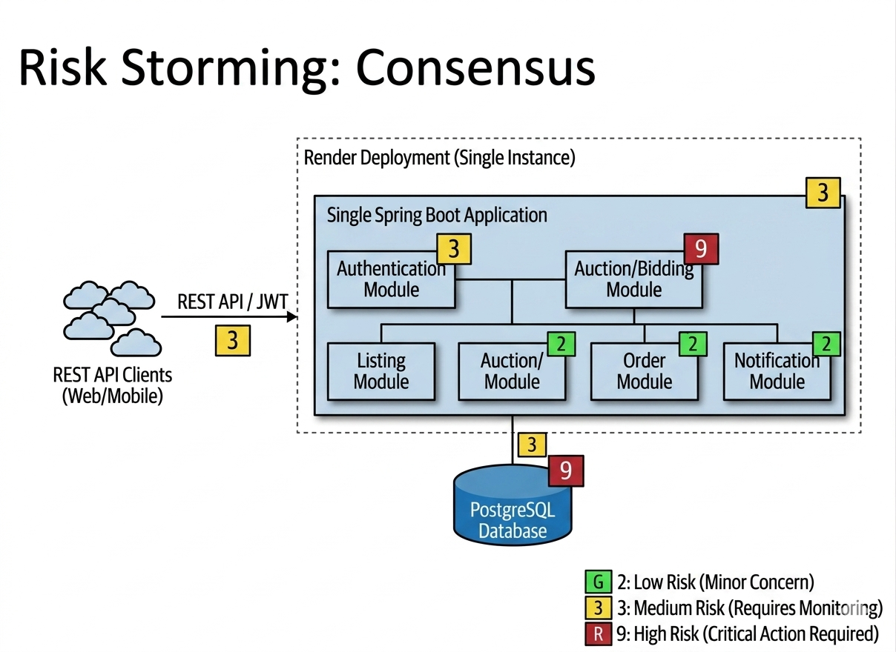
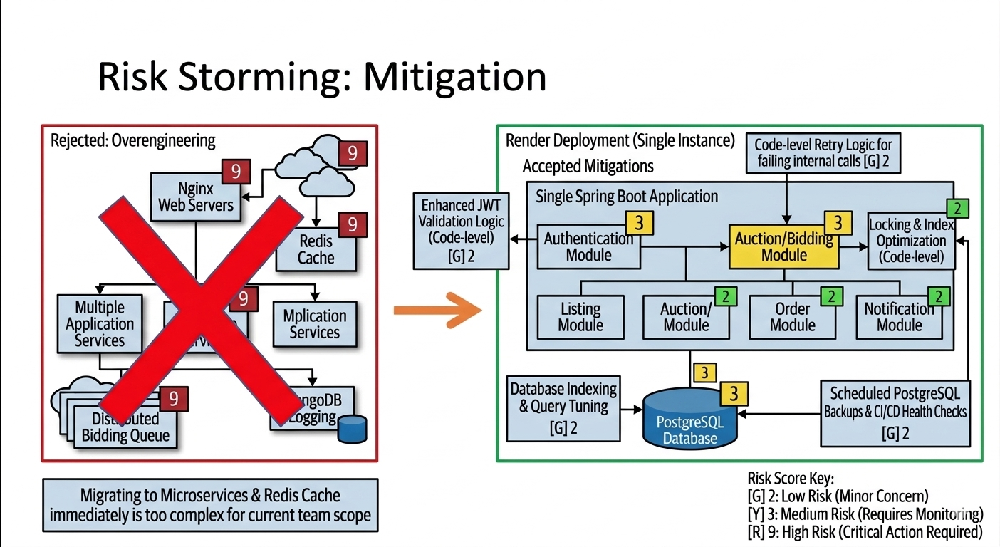

# BidMart — Group B11

## 1. Current Architecture — Context, Container, and Deployment Diagram

### System Context Diagram

System Context Diagram ini memberikan gambaran ekosistem platform BidMart. Diagram ini menempatkan BidMart sebagai sistem utama di tengah dan memetakan bagaimana sistem tersebut berinteraksi dengan para penggunanya secara langsung, serta ketergantungannya pada sistem eksternal untuk dapat menjalankan proses bisnis lelang dan marketplace secara real-time.

**Aktor yang terlibat:**
- **Pembeli/Buyer** → Pengguna yang menelusuri katalog barang, mengajukan penawaran (bid) pada lelang, menerima pembaruan harga secara real-time, serta mengelola saldo dompet digital mereka untuk keperluan transaksi. 
- **Penjual/Seller** → Pengguna yang membuat dan mendaftarkan listing barang lelang, memantau status penawaran yang masuk, dan memproses pengiriman pesanan kepada pemenang setelah lelang selesai. 
- **Administrator** → Pihak internal yang bertugas mengawasi operasional platform secara keseluruhan, memoderasi pengguna atau listing yang melanggar aturan, serta menangani sengketa transaksi antara pembeli dan penjual. 
- **Sistem Pembayaran/Payment Gateway** → Sistem eksternal pihak ketiga yang digunakan oleh BidMart untuk memproses aktivitas keuangan pengguna, seperti top-up saldo, penarikan dana (withdrawal), serta menangani permintaan penahanan dan pemindahan dana (callback status pembayaran). 
- **Sistem Notifikasi/Notification Service** → Layanan pihak ketiga yang menerima payload dari BidMart untuk mengirimkan pesan peringatan, update status lelang, atau pemberitahuan pesanan langsung kepada pengguna melalui medium seperti email atau push notification. 

---

### Container Diagram

BidMart saat ini menggunakan arsitektur **monolith** dengan satu backend Spring Boot yang menangani semua modul.

**Container yang ada:**
- **Frontend (Next.js)** → di-host di Vercel, berkomunikasi via REST API
- **Backend Monolith (Spring Boot)** → di-host di Render, berisi:
  - Auth Module (autentikasi & manajemen user)
  - Catalog Module (katalog & listing)
  - Bidding Module (lelang & penawaran)
  - Wallet Module (dompet & saldo)
  - Order Module (pemesanan & notifikasi)
- **Database (PostgreSQL)** → diakses langsung oleh backend

## 1. API Layer (Controllers)
Semua interaksi klien masuk melalui lapisan ini. Layer ini bertugas sebagai pintu gerbang utama yang memproses permintaan HTTP dan mengembalikan respons yang sesuai.

* **Controllers:** Mencakup kelas seperti `BidController`, `WalletController`, `UserController`, `OrderController`, dan `ListingController`.
* **Security:** Lapisan ini dilindungi oleh `SecurityConfig` dan `JwtAuthenticationFilter` yang berada di package `config`. Hal ini memastikan setiap permintaan telah terautentikasi dan terotorisasi menggunakan **JWT Token**.

## 2. Core Domain Modules (Komponen Kontainer)
Aplikasi dibagi menjadi beberapa domain utama yang saling bekerja sama secara kohesif untuk menjalankan logika bisnis:

| Modul | Deskripsi | Komponen Utama |
| :--- | :--- | :--- |
| **User Module** | Mengelola profil dan keamanan pengguna. | `JwtServiceImpl`, `MfaServiceImpl`, `SessionService`. |
| **Wallet Module** | Menangani transaksi finansial dan saldo. | Logika *HoldBalance* (Penahanan Saldo). |
| **Listing Module** | Mengelola entitas barang, kategori, dan status lelang. | `ListingService`, `CategoryRepository`. |
| **Bidding Module** | Otak utama aplikasi yang mengatur jalannya lelang. | `AuctionStrategy`, `StandardBidValidatorImpl`, `AuctionExpiryScheduler`. |

## 3. Event-Driven Mechanism (Message Broker / Event Bus)
Ini adalah keunggulan arsitektur proyek ini untuk menjaga performa sistem tetap responsif (*non-blocking*). Dibandingkan melakukan pemanggilan antar-modul secara langsung (sinkron), sistem ini menggunakan pola **Publisher-Subscriber**.

### Alur Kerja Event:
1.  **Trigger:** Terjadi aksi di modul utama (misal: lelang berakhir atau tawaran masuk).
2.  **Publish:** Sistem menembakkan event terkait:
    * `AuctionWonEvent`: Ditembakkan saat pemenang lelang ditentukan.
    * `BidPlacedEvent`: Ditembakkan saat ada penawaran baru yang valid.
3.  **Subscribe (Listener):** Kelas listener bekerja di latar belakang untuk merespons event:
    * `OrderEventListener`: Membuat pesanan otomatis saat lelang dimenangkan.
    * `NotificationEventListener`: Mengirimkan notifikasi langsung ke pengguna.

## 4. Data Layer (Repositories & Database)
Setiap modul memiliki lapisan persistensi datanya sendiri untuk menjaga isolasi data dan kemudahan pemeliharaan.

* **Repositories:** Menggunakan Spring Data JPA (misal: `WalletRepository`, `OrderRepository`, `BidRepository`).
* **Database:** Menghubungkan entitas model (Java Objects) langsung ke sistem basis data relasional secara efisien melalui pemetaan ORM.

---

### Deployment Diagram

Aplikasi BidMart dibangun dengan arsitektur cloud-native yang memisahkan sisi klien dan server. Front-end dikembangkan menggunakan Next.js dan di-hosting pada Global CDN agar dapat diakses dengan cepat dan aman oleh pengguna melalui peramban web (HTTPS). Sementara itu, pusat logika bisnis aplikasi dijalankan oleh backend berarsitektur modular monolith berbasis Spring Boot (Java 21). Backend ini di-deploy sebagai web service di platform Render untuk menerima dan merespons permintaan REST API dari frontend.
Untuk penyimpanan data persisten, sistem ini menggunakan basis data PostgreSQL secara serverless di Neon Cloud yang terhubung dengan backend secara aman melalui protokol JDBC dengan enkripsi SSL. Seluruh infrastruktur ini dikelola secara otomatis melalui pipeline CI/CD di GitHub.

## 2. The future architecture of the group B11
Setelah melakukan Risk Storming pada arsitektur BidMart saat ini, kami mengidentifikasi sejumlah risiko signifikan yang dapat mengancam ketersediaan, skalabilitas, dan integritas data apabila sistem mengalami peningkatan beban besar (misalnya ribuan auction berjalan bersamaan dengan puluhan ribu bidder aktif secara bersamaan).

### Risk Matrix pada Arsitektur Monolith Saat Ini
Setelah melakukan Risk Storming pada arsitektur BidMart saat ini yang berbasis Spring Boot modular monolith, kami mengidentifikasi sejumlah risiko krusial yang mengancam ketersediaan, skalabilitas, dan integritas data saat sistem menghadapi lonjakan beban (misalnya ribuan auction dan puluhan ribu bidder aktif secara bersamaan). Berdasarkan matriks risiko, ancaman terbesar bermuara pada jalur transaksi utama dan keamanan. Dari sisi transaksi, race condition akibat penawaran serentak (bidding concurrency) dapat memicu kesalahan penentuan pemenang atau penahanan saldo ganda. Selain itu, inkonsistensi pada operasi Modul Wallet—seperti hold, release, atau settlement—berisiko fatal menyebabkan saldo negatif atau double spend. Dari segi keamanan dan aliran data, ketiadaan kontrol akses terpusat dapat meloloskan aksi pengguna yang tidak sah, sementara hilangnya event penting seperti BidPlaced atau WinnerDetermined akan membuat modul Katalog, Pesanan, dan Notifikasi gagal bereaksi. 

### Future Architecture Diagram
Berdasarkan hasil risk storming di atas, kami merancang ulang arsitektur kami.

#### Future Context Diagram

#### Future Container Diagram

Untuk memitigasi risiko-risiko di atas, future architecture BidMart dirancang ulang menjadi microservices. Perombakan ini dilakukan karena setiap modul memiliki karakteristik beban yang ketimpang: Modul Bidding menuntut pemrosesan yang sangat cepat, Modul Wallet mewajibkan jaminan integritas finansial absolut (zero error), sementara Modul Notification lebih ideal diproses secara asinkron. Sebagai solusi, tanggung jawab dipecah ke dalam layanan-layanan independen dengan database mandiri. API Gateway dan Auth Service diimplementasikan sebagai pusat validasi identitas di garda depan. Untuk menjaga integritas bidding, sistem menerapkan penguncian (lock) per listing dan mewajibkan panggilan sinkronus (sync call) ke Wallet Service guna menahan saldo secara atomik sebelum penawaran diterima. Sementara itu, alur kerja lintas layanan (cross-service workflow) ditangani menggunakan message broker yang tangguh, sehingga layanan pendukung dapat bereaksi secara asinkron tanpa memblokir performa utama sistem. 

## 3. Explanation of Risk Storming

### Risk Storming: Identification

Pada tahap identification, setiap anggota tim secara individual mengidentifikasi area yang memiliki potensi risiko pada arsitektur BidMart. Karena BidMart masih menggunakan arsitektur modular monolith dengan single Spring Boot application dan single PostgreSQL database, beberapa risiko utama yang ditemukan adalah bottleneck pada proses auction/bidding, kemungkinan race condition saat banyak user melakukan bidding secara bersamaan, serta PostgreSQL yang menjadi single point of failure. Selain itu, authentication module dan REST API juga dianggap memiliki risiko menengah karena berkaitan dengan keamanan JWT dan performa request handling.

---

### Risk Storming: Consensus

Pada tahap consensus, seluruh anggota tim mendiskusikan hasil identification untuk menentukan tingkat risiko akhir yang paling realistis berdasarkan implementasi aktual project. Hasil diskusi menunjukkan bahwa Auction/Bidding Module dan PostgreSQL Database memiliki tingkat risiko tertinggi karena berhubungan langsung dengan konsistensi transaksi, concurrent access, dan ketergantungan seluruh sistem terhadap satu database utama. Sementara itu, module lain seperti Notification Module dianggap memiliki risiko lebih rendah karena kompleksitas dan dependency yang lebih kecil dibanding module bidding.

---

### Risk Storming: Mitigation

Pada tahap mitigation, tim menentukan solusi yang realistis untuk mengurangi risiko tanpa melakukan overengineering terhadap project. Tim memutuskan untuk tidak langsung bermigrasi ke microservices atau menambahkan infrastruktur kompleks seperti Redis dan distributed queue karena belum sesuai dengan kebutuhan dan skala project saat ini. Sebagai gantinya, mitigasi difokuskan pada optimasi query dan indexing database, locking mechanism pada proses bidding, peningkatan validasi JWT, penambahan automated testing dan CI/CD health checks, serta refactoring modular separation agar maintainability dan reliability sistem meningkat secara bertahap.

## 4. Individual Work — Component Diagram & Code Diagrams
Berikut adalah component diagram dan code diagram dari masing-masing modul.

### 4.1 Bidding Module
Modul Bidding bertanggung jawab atas seluruh mekanisme lelang dalam sistem BidMart. Modul ini menangani penempatan bid, validasi aturan lelang, strategi tipe auction, reservasi dana wallet, anti-sniping, penutupan auction otomatis, serta penerbitan domain events ke modul lain. Modul ini merupakan komponen paling kritis dalam sistem karena berinteraksi langsung dengan modul Catalog, Wallet, dan Order melalui internal Spring events.

#### Component Diagram : Bidding Module
Diagram ini menunjukkan bagaimana setiap komponen berinteraksi satu sama lain serta terdapat hubungan dengan modul eksternal (Catalog, Wallet, Auth).

#### Code Diagram 1 : BidService Class Diagram
Diagram berikut menampilkan class diagram dari BidService beserta seluruh dependensinya (C4 Level 4). BidService adalah pusat dari modul Bidding yang mengorkestrasikan seluruh alur penempatan bid, mulai dari validasi input, pengambilan data listing dengan pessimistic lock, validasi business rules, reservasi dana wallet, penyimpanan bid, anti-sniping extension, hingga penerbitan domain events.

Method utama placeBid() dianotasi dengan @Retryable (maksimal 3 percobaan dengan backoff 50ms × 2) untuk menangani ObjectOptimisticLockingFailureException yang dapat terjadi saat banyak bidder bersaing secara bersamaan. Jika semua retry gagal, @Recover method akan melempar BidConflictException dengan pesan yang informatif kepada user.

#### Code Diagram 2 : Bid Entity, DTOs & Repository
Diagram berikut menampilkan class diagram dari Bid entity, DTO-DTO terkait (CreateBidRequest, BidResponse, ErrorResponse), dan BidRepository (C4 Level 4). Diagram ini menggambarkan struktur data yang menjadi fondasi dari modul Bidding, termasuk field-field database, annotations JPA, serta custom query methods pada repository.

Bid entity memiliki method getReservedAmount() yang mengembalikan proxyMaxLimit jika bid adalah proxy bid, atau amount jika bukan. Nilai ini digunakan oleh WalletService untuk menentukan jumlah dana yang perlu di-reserve atau di-release saat terjadi outbid.

#### Code Diagram 3 : Auction Strategy Pattern
Diagram berikut menampilkan class diagram dari implementasi Strategy Pattern untuk mendukung berbagai tipe auction (C4 Level 4). Dengan pattern ini, BidMart dapat dengan mudah menambahkan tipe lelang baru (misalnya Dutch Auction atau Sealed Bid) tanpa mengubah kode BidService.

AuctionStrategyRegistry menerima semua bean implementasi AuctionStrategy dari Spring container secara otomatis melalui constructor injection, lalu memetakannya ke Map<AuctionType, AuctionStrategy>. Saat ini terdapat satu implementasi aktif yaitu EnglishAuctionStrategy (open ascending-price auction) yang memerlukan fund holding (requiresFundHolding() = true) dan menghitung minimum bid berikutnya sebagai currentHighestBid + 1.

#### Code Diagram 4 : BidRuleValidator & Domain Events
Diagram berikut menampilkan class diagram dari BidRuleValidator (interface dan implementasinya), seluruh domain events yang diterbitkan oleh modul Bidding, BiddingEventListener, serta exception-exception yang dapat dilempar (C4 Level 4).

BidRuleValidator menerapkan validasi dua fase yang terpisah secara sengaja:
- Phase 1 (validateRequest) — validasi input murni tanpa I/O: null check, amount > 0, proxyMaxLimit ≥ amount. Fase ini dilakukan sebelum query apapun ke database agar sistem dapat gagal lebih awal (fail-fast)
- Phase 2 (validateBidContext) — validasi business rules setelah data listing dan highest bid tersedia: buyer ≠ seller, auction masih open, bid > current highest bid

Domain events yang diterbitkan oleh modul Bidding menggunakan Spring ApplicationEventPublisher dengan @TransactionalEventListener(AFTER_COMMIT) agar events hanya diterbitkan setelah transaksi database berhasil di-commit, mencegah terjadinya notifikasi palsu jika transaksi rollback.

# Dokumentasi Arsitektur Modul Order & Notification

Repositori ini memuat dokumentasi arsitektur perangkat lunak untuk Modul **Order** dan **Notification** pada sistem BidMart. Visualisasi diagram di bawah ini mengacu pada standar C4 Model, yang difokuskan pada *Component Diagram* (Level 3) dan *Code Diagram* (Level 4), serta dilengkapi dengan diagram interaksi *behavioral*.

## 1. Component Diagram
Diagram komponen ini menunjukkan struktur internal dari modul Order dan Notifikasi, serta bagaimana kedua modul ini berinteraksi satu sama lain secara *asynchronous* melalui *Event Bus* (Spring ApplicationEventPublisher).

.png)

## 2. Code Diagrams (UML Class Diagrams)
*Code Diagram* ini merepresentasikan secara detail elemen statis dari kode sumber (kelas, antarmuka, atribut, dan metode) yang menyusun masing-masing modul sesuai komit terakhir.

### Modul Order
Struktur kelas yang menangani entitas pesanan dan integrasi *event* dari sistem lelang.

### Modul Notification
Struktur kelas yang bertanggung jawab atas penangkapan *event* (*listeners*) dan pengiriman pesan notifikasi ke *database*.

## 3. Sequence Diagrams
Diagram ini melengkapi arsitektur struktural dengan menjabarkan alur perilaku (*behavioral*) dari interaksi sistem berdasarkan skenario *Event-Driven* yang spesifik.

### Skenario Konfirmasi Pesanan
Alur proses saat pembeli mengonfirmasi penerimaan barang, yang memicu perubahan status pesanan dan pengiriman *event* notifikasi ke penjual.

### Skenario Menangkap Event Lelang Selesai
Alur eksekusi asinkron di mana sistem secara otomatis membuat entitas pesanan dan menyebarkan notifikasi ke pihak terkait tepat setelah lelang ditutup.

.png)

### Container Diagram Autentikasi & Manajemen Pengguna

Tautan jika kurang jelas: https://drive.google.com/file/d/1NvWYGCrOJAlytABfcxlOuPqCsFCfL0iI/view?usp=sharing

### Code Diagram
#### 2FA

Tautan jika kurang jelas: https://drive.google.com/file/d/1EJ_wxfaywynfzSRfTSQ_f5pmoO0-dBlL/view?usp=sharing
#### Auth Service

Tautan jika kurang jelas: https://drive.google.com/file/d/1NEAjQURtmMyiCb5ZEcULDbZa_1ZVi8OP/view?usp=sharing
#### Session Management

Tautan jika kurang jelas: https://drive.google.com/file/d/1ZcYVNuLfBnKHdu4FxXjpr5NNT-GcK68Y/view?usp=sharing
#### User Profile Service

Tautan jika kurang jelas: https://drive.google.com/file/d/1ysNmiDcInMt4nBvUXqDZcalaIwkeJcCS/view?usp=sharing

